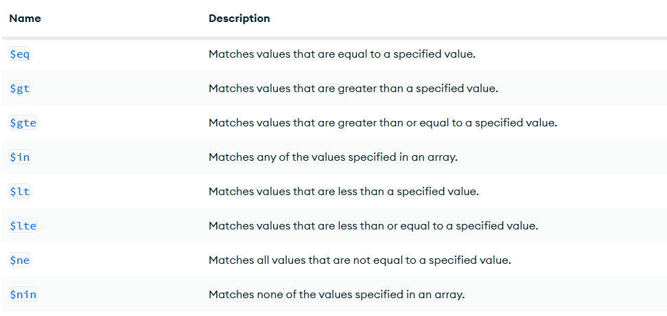
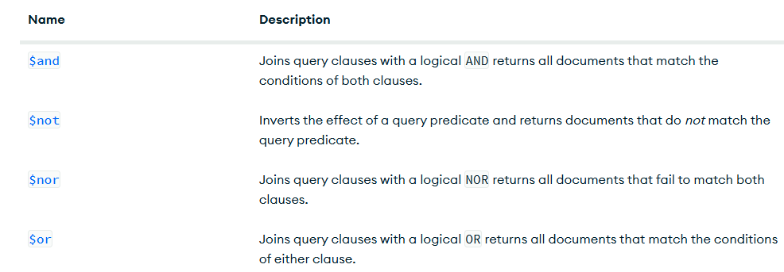

#CRUD y consultas en MongoDB


```json
db.Alumnos.insertOne(
{
    _id : 3,
    nombre : 'Sergio',
    Apellidos : 'Ramos',
    equipo : 'Monterrey',
    aficiones: ['Dinero', 'Hombres', 'Fiesta'],
    talentos: {
        futbol : true,
        bañarse : false
    }
}
)
```


# Practica 1

## Cargar datos

[Libros.json](./data/libros.json)

## Busqueda. Cindiciones simples de igualdad. Metodo Find() 

1. Seleccionar todos los documentos de la coleccion libros

```json
db.libros.find()
```
1. Mostrar todos los ducumentos que sean de la editoria 'Biblio'

```json
 db.libros.find({editorial: 'Biblio'})
```

1. Mostrar todos los documentod que el precio sea 25
```json
db.libros.find({precio: 25})
```

1. Seleccionar todos los documentos donde el titulo sea json para todos
```json
db.libros.find({titulo: 'JSON para todos'})
```

## Operadores de Comparacio

https://www.mongodb.com/docs/manual/reference/operator/query/




1. Mostrar todos los documentos donde el precio sea mayorn a 25

```json
db.libros.find({ precio: { $gt: 25 } } )
```

1. Mostrar los documentos donde el precio sea 25

```json
db.libros.find({ precio: { $eq: 25 } } )
```

1. Mostrar los documentos cuya cantidad sea menor a 5

```json
db.libros.find({ cantidad: { $lt: 5 } } )
```

1. Mostrar los documentos que pertenezcan a la editorial biblio o planeta

```json
db.libros.find({ editorial: { $in:['Biblio','Planeta'] } } )
```

1. Mostrar todos los documentos de libros que cuesten 20 o 25
```json
db.libros.find({ precio: { $in:[20,25] } } )
```

1. Mostrar todos los documentos de libros que no cuesten 20 o 25

```json
db.libros.find({ precio: { $nin:[20,25] } } )
```

1. Mostrar el primer documento de libros que cuesten 20 o 25

```json
 db.libros.findOne( { precio: { $in: [20, 25] } } )
```

## Operadores Lógicos

[Operadores Logicos](https://www.mongodb.com/docs/manual/reference/operator/query/)



## Operador AND

Dos posibles opciones de AND

1. La simple, mediante condiciones separadas por comas (,)

**Sintaxis** 

db.coleccion.find({condicione1, condicion2}) -> Con esto asume que es un AND

2. Usando el operador $and 

**Sintaxis**

db.coleccion.find({$and:[{condicion1},{condicion2}]})

### Ejercicios 

1. Mostrar todos aquellos libros que cuesten mas de 25 y cuya cantidad sea inferior a 15

*** Forma Simple ***

```json
 db.libros.find({precio: {$gt:25}, cantidad:{$lt:15}})
```

*** Forma Operador $and ***

```json
db.libros.find( { $and: [{ precio: { $gt: 25 }, cantidad: { $lt: 15 } }] } )

```

2. Mostrar todos aquellos libros con id 4

```json
db.libros.find( { $and: [{ precio: { $gt: 25 }, cantidad: { $lt: 15 }, _id:{$eq:4} }] } )
```

## Operador OR ##
1. Mostrar todos aquellos libros que cuesten mas de 25 o cuya cantidad sea inferior a 15

```json

db.libros.find({ $or: [{ precio: { $gt: 25 } }, { cantidad: { $lt: 15 } }] } )

```

1. 