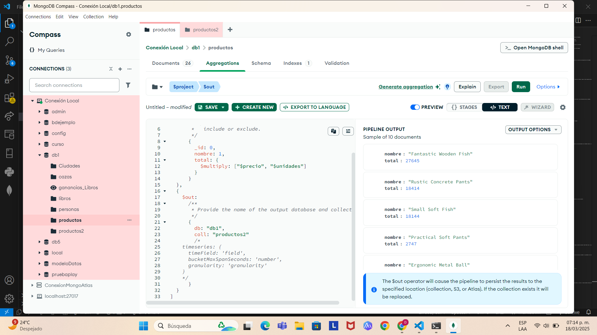

## Practica 5 Agregaciones ##

1. Para hacer esta práctica vamos a cargar unos datos ficticios de empresas.

2. Tienes un fichero denominado “productos.json”

3. Debes poner el resultado de las consultas en cada apartado

- Cuenta los productos de tipo “medio”, usando un método básico

```json
db.productos.find({tipo:'medio'}).size()
```

- Indicar con un distinct, las empresas (fabricantes) que hay en la colección

```json
db.productos.distinct('fabricante')
```

- Usando aggregate, visualizar los productos que tengan más de 80 unidades

```json

[
  {
    $match:
      /**
       * query: The query in MQL.
       */
      {
        unidades: {
          $gt: 80
        }
      }
  }
]
```

- Con $project visualizar solo el nombre, unidades y precio de los productos que tengan menos de 10 unidades

```json
[
  {
    $match:
      /**
       * query: The query in MQL.
       */
      {
        unidades: {
          $lt: 10
        }
      }
  },
  {
    $project:
      /**
       * specifications: The fields to
       *   include or exclude.
       */
      {
        _id: 0,
        nombre: 1,
        unidades: 1,
        precio: 1
      }
  }
]
```

- Con $project ponemos el fabricante pero le cambiamos el nombre por “empresa”. Usamos el mismo comando anterior

```json
[
  {
    $match:
      /**
       * query: The query in MQL.
       */
      {
        unidades: {
          $lt: 10
        }
      }
  },
  {
    $project:
      /**
       * specifications: The fields to
       *   include or exclude.
       */
      {
        _id: 0,
        nombre: 1,
        unidades: 1,
        precio: 1,
        Empresa: "$fabricante"
      }
  }
]
```

- Añadir a la consulta anterior un campo calculado que se llame total y que multiplique precio por unidades.

```json
[
  {
    $match:
      /**
       * query: The query in MQL.
       */
      {
        unidades: {
          $lt: 10
        }
      }
  },
  {
    $project:
      /**
       * specifications: The fields to
       *   include or exclude.
       */
      {
        _id: 0,
        nombre: 1,
        unidades: 1,
        precio: 1,
        Empresa: "$fabricante",
        total: {
          $multiply: ["$precio", "$unidades"]
        }
      }
  }
]
```

- Hacer que el nombre salga en mayúsculas con el operador $toUpper

```json
[
  {
    $match:
      /**
       * query: The query in MQL.
       */
      {
        unidades: {
          $lt: 10
        }
      }
  },
  {
    $project:
      /**
       * specifications: The fields to
       *   include or exclude.
       */
      {
        _id: 0,
        nombre: {
          $toUpper: "$nombre"
        },
        unidades: 1,
        precio: 1,
        Empresa: "$fabricante",
        total: {
          $multiply: ["$precio", "$unidades"]
        }
      }
  }
]
```

- Añadir un campo calculado que ponga el nombre del producto y el tipo concatenado con el operador $concat. Le llamamos al campo “completo”

```json
[
  {
    $match:
      /**
       * query: The query in MQL.
       */
      {
        unidades: {
          $lt: 10
        }
      }
  },
  {
    $project:
      /**
       * specifications: The fields to
       *   include or exclude.
       */
      {
        _id: 0,
        nombre: {
          $toUpper: "$nombre"
        },
        unidades: 1,
        precio: 1,
        Empresa: "$fabricante",
        total: {
          $multiply: ["$precio", "$unidades"]
        },
        completo: {
        $concat: ["$nombre", "$tipo"]
        }
      }
  }
]
```

- Ordena el resultado por el campo “total”

```json
[
  {
    $match:
      /**
       * query: The query in MQL.
       */
      {
        unidades: {
          $lt: 10
        }
      }
  },
  {
    $project:
      /**
       * specifications: The fields to
       *   include or exclude.
       */
      {
        _id: 0,
        nombre: {
          $toUpper: "$nombre"
        },
        unidades: 1,
        precio: 1,
        Empresa: "$fabricante",
        total: {
          $multiply: ["$precio", "$unidades"]
        },
        completo: {
          $concat: ["$nombre", "$tipo"]
        }
      }
  },
  {
    $sort:
      /**
       * Provide any number of field/order pairs.
       */
      {
        total: 1
      }
  }
]
```

- Haciendo una nueva consulta, averiguar el numero de productos por tipo de producto

```json
[
  {
    $group:
      /**
       * _id: The id of the group.
       * fieldN: The first field name.
       */
      {
        _id: "$tipo",
        cantidad: {
          $sum: 1
        }
      }
  }
]
```

- Añadir el valor mayor y el menor
```json
[
  {
    $group:
      /**
       * _id: The id of the group.
       * fieldN: The first field name.
       */
      {
        _id: "$tipo",
        cantidad: {
          $sum: 1
        },
        mayor: {
          $max: "$precio"
        },
        menor: {
          $min: "$precio"
        }
      }
  }
]
```

- Añade el total de unidades por cada tipo

```json
[
  {
    $group:
      /**
       * _id: The id of the group.
       * fieldN: The first field name.
       */
      {
        _id: "$tipo",
        cantidad: {
          $sum: 1
        },
        mayor: {
          $max: "$precio"
        },
        menor: {
          $min: "$precio"
        },
        totalUnidades: {
          $sum: "$unidades"
        }
      }
  }
]
```

- Con el operador $set y el operador “$substr” visualiza todos los datos del producto "Small Metal Tuna" y los primeros 5 caracteres del nombre.

```json
[
    {
         $match: { nombre: "Small Metal Tuna" }  
     },
     {
         $set: {
             nombreCorto: { $substr: ["$nombre", 0, 5] }  
         }
     }
 ]
```

- Creamos una salida que tenga el nombre del articulo y el total (precio por unidades) y lo guardamos en una colección denominada productos2

```json
[
  {
    $project:
      /**
       * specifications: The fields to
       *   include or exclude.
       */
      {
        _id: 0,
        nombre: 1,
        total: {
          $multiply: ["$precio", "$unidades"]
        }
      }
  },
  {
    $out:
      /**
       * Provide the name of the output database and collection.
       */
      {
        db: "db1",
        coll: "productos2"
        /*
    timeseries: {
      timeField: 'field',
      bucketMaxSpanSeconds: 'number',
      granularity: 'granularity'
    }
    */
      }
  }
]
```

- Comprobamos que se ha creado



- Hacemos un find para comprobar el resultado

```json
db.productos2.find({})
```

- Usando $cond y $project vamos a visualizar el nombre del producto, el precio y un campo llamado valoración que ponga “barato” si el precio es menor de 250 y caro si es mayor o igual

```json
[
  {
    $project:
      /**
       * specifications: The fields to
       *   include or exclude.
       */
      {
        _id: 0,
        nombre: 1,
        total: {
          $multiply: ["$precio", "$unidades"]
        },
        valoracion: {
          $cond: [
            {
              $lt: ["$precio", 250]
            },
            "barato",
            "Ta rre caro!"
          ]
        }
      }
  },
  {
    $out:
      /**
       * Provide the name of the output database and collection.
       */
      {
        db: "db1",
        coll: "productos2"
        /*
    timeseries: {
    timeField: 'field',
    bucketMaxSpanSeconds: 'number',
    granularity: 'granularity'
    }
    */
      }
  }
]
```